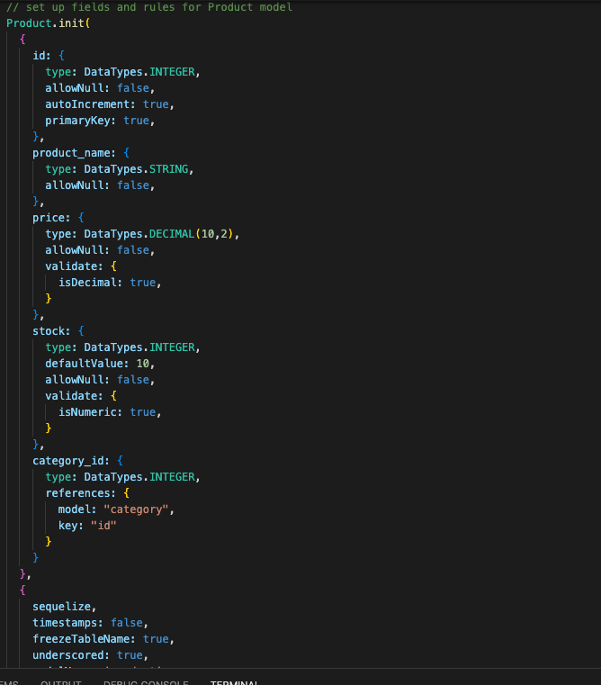
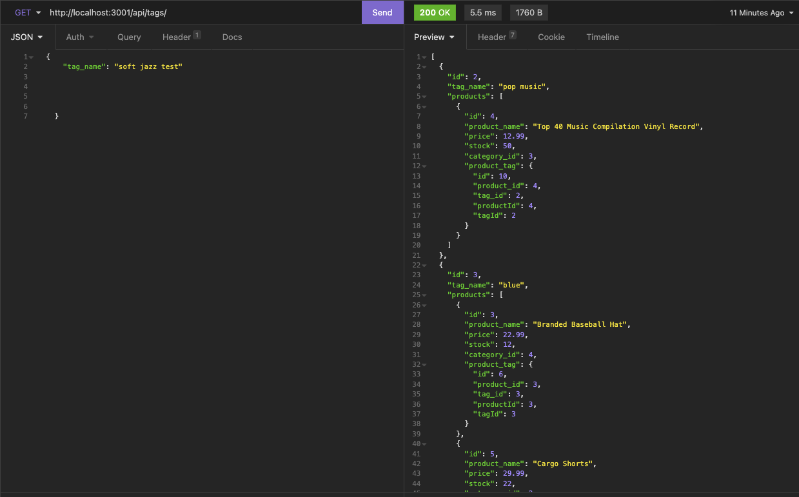
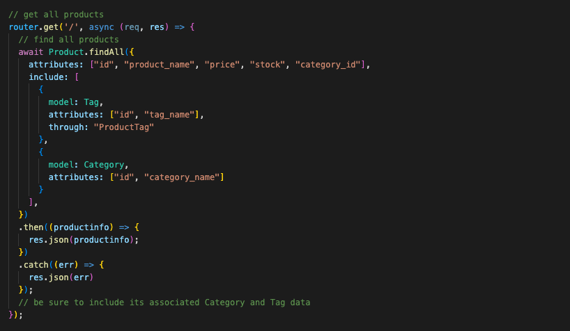

# E-Commerce-Back-End

## Description
Using mysql and sequlize, this is a e commerce backend website to provide the vendor with control to check the items, update the items and delete any items in their inventory which is in this database.

## My Task
My task for this project was to create a database from the starter code provided where i can get the information, replace/update the informaton and delete the information from the table.  I was to create the routes and models for the code to work correctly.

## List of Technologies Used
- npm
- sequlize
- javascript
- mysql
- databases
- insomina
- mySQL workbench

## Github URL
https://github.com/mclanea92/E-Commerce-Back-End

## Video Tutorial
https://drive.google.com/file/d/1KtZyAQ66h8TrK5S0CBSvpzEOsvKr9Qs-/view?usp=sharing

## Acceptance Criteria
```md
GIVEN a functional Express.js API
WHEN I add my database name, MySQL username, and MySQL password to an environment variable file
THEN I am able to connect to a database using Sequelize
WHEN I enter schema and seed commands
THEN a development database is created and is seeded with test data
WHEN I enter the command to invoke the application
THEN my server is started and the Sequelize models are synced to the MySQL database
WHEN I open API GET routes in Insomnia for categories, products, or tags
THEN the data for each of these routes is displayed in a formatted JSON
WHEN I test API POST, PUT, and DELETE routes in Insomnia
THEN I am able to successfully create, update, and delete data in my database
```

## Tests
To test this, you will need to first open the terminal and download sequlize & mysql from npm. Once you do that update the .env file to your information.  To run the server in the terminal put 'node server'.  After this, you will want to upload your seed data.  In the terminal you will run 'node seeds'.  Once this is done you can go to insomina to test the get routes, the put routes and the delete routes.

## Screenshots

The screenshot below is the model for Products which let the server and database know what the table should look like.


The screenshot below is from insomina when it was getting the tags from the database


This last screenshot is the api routes made for the server which help insomina access the database correctly

